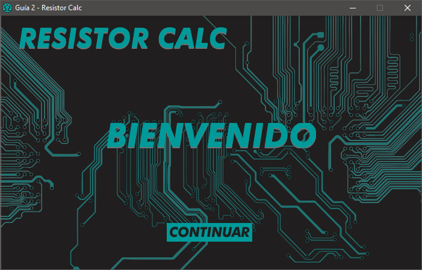

# UD - Programación Aplicada - 2016-3

## Guía 2 - Parte 1

Solución parte uno de la guía 2, actividad de aprendizaje de la materia Programación Aplicada impartida en la Universidad Distrital de Bogotá, Colombia.

## Requisitos

Realice una aplicación en entorno gráfico (GUI) que calcule el valor de una resistencia a partir de su combinación de colores. Agregar un convertidor de unidades (MegaOhm – KiloOhm – Ohm – miliOhm, etc) que se pueda utilizar al momento de tener calculado el valor de la resistencia. Debe mostrar una imagen de la resistencia con los colores seleccionados antes de efectuar el cálculo correspondiente.

## Programa

Pantalla de bienvenida (Fig. 1), la cuál consta de un `JButton`, y dos `JLabel`, en los cuales se encuentran contenidas las imágenes del fondo, y de la palabra ”BIENVENIDO”. 

Después de presionar el `JButton` ”CONTINUAR”, se muestra un contenedor dentro del mismo `JFrame`, ´este contenedor, o Container, contiene un conjunto de `JButton` y `JLabel`, y un `JComboBox`, los cuáles le dan funcionalidad al programa. El usuario al presionar cada `JButton` con forma de flecha, cambia los colores de cada banda dentro de la resistencia dibujada en pantalla mediante el uso de `JLabel` e imágenes.

